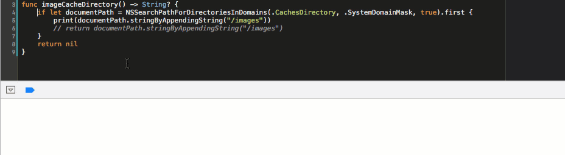
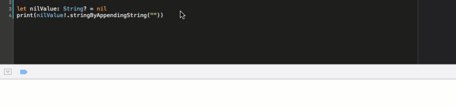

## VWInstantRun

How many times you have to build and run your whole project when you just want to run 
a small piece of code to test a tiny doubt ?

Now with VWInstantRun, you won't run into this situation any more. An Xcode plugin which 
let you run your selected lines of code in Xcode without run the whole project.

<!--

-->

### Installation

Installation: You can clone or just download the project, then open project with Xcode, 
build and run project, and finally restart Xcode to active plugin.

### Alcatraz - Recommandation

Another easier option: This plugin can also be installed using [Alcatraz](https://github.com/alcatraz/alcatraz-packages). 
Just search for VMInstantRun in [Alcatraz](https://github.com/alcatraz/alcatraz-packages).

### Details

Generally you just select your code in Xcode, then either use hotkey `⌘⌥⇧ + R` or go to `Product -> Instant Run` to 
build and run the lines of code selected. 

The whole purpose of this plugin is run your code snippet instantly without build the whole project, so it do have some limitations 
obviously. The code selected should be isolated from other context, otherwise you will only have some compiler errors when you run that code snippet. For now, it only import Foundation module.

### Todo List
This plugin is still in a very early stage, here is a TODO list to show you a simple roadmap.
- [x] Swift code support.
- [ ] Objective-C code support. (In progress, should be done soon)
- [ ] More modules support.
- [ ] Run selected code with arguments inputed by user.

### More info from my blog
You can checkout more implementation details in this [blog post](..)